# TimeSeries_ElectricLoad

# Electricity Load and Weather Analysis in Taiwan

This repository contains the code and data used for analyzing the electricity load and weather patterns in Taiwan. The analysis aims to investigate the relationship between electricity load and weather factors, and predict future electricity development in Taiwan.

## Abstract

The abstract provides an overview of the project and its objectives, including the use of a shallow learning model for prediction and the potential implications for energy allocation in Taiwan.

## Introduction

The introduction section introduces the project and outlines the various steps involved, including data preprocessing, time series decomposition, model selection, and prediction.

## Dataset Description

The dataset used in this project is sourced from Kaggle and includes electricity load data and weather data for Taiwan from 2017 to 2021. The dataset consists of several variables, including time series data, categorical variables, and numerical variables related to weather and climate factors.

Time versus load

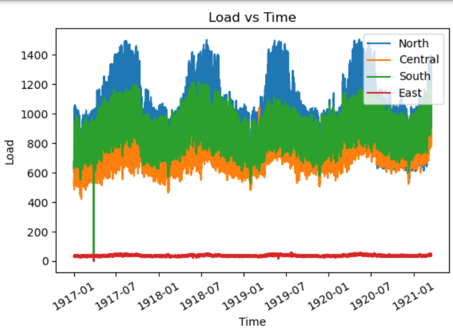

ACF/PACF of the dependent variable

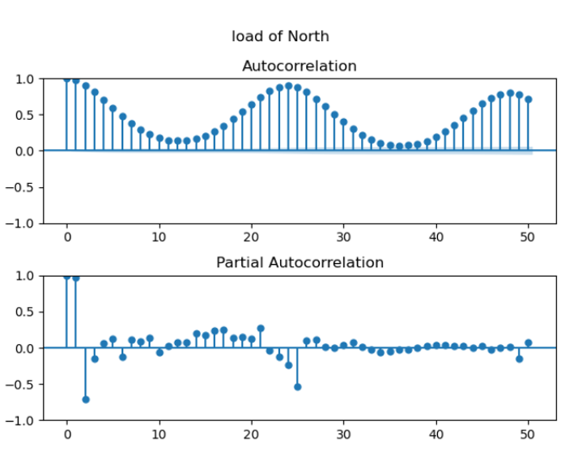

Correlation matrix

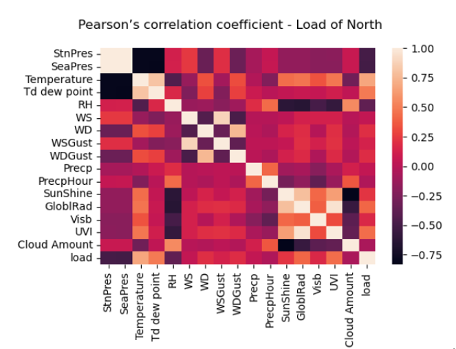

## Preprocessing

The preprocessing section describes the steps taken to clean and prepare the dataset for analysis, including handling missing values, filling data based on distribution, and splitting the dataset into training and testing sets.

## Stationarity

Rolling mean and variance of load of North

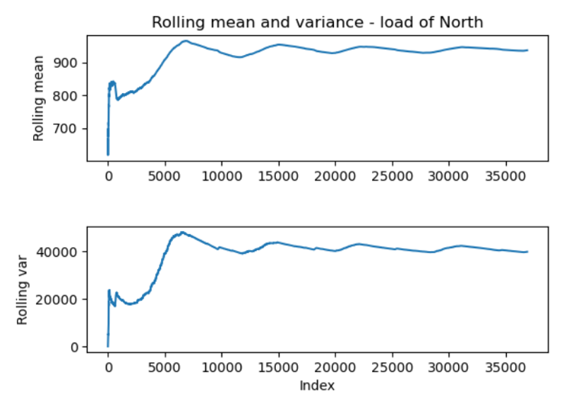

The stationarity section examines the stationarity of the data using ADF and KPSS tests, as well as rolling mean and variance analysis.

## Time Series Decomposition

The result of trending and seasonality of the original data

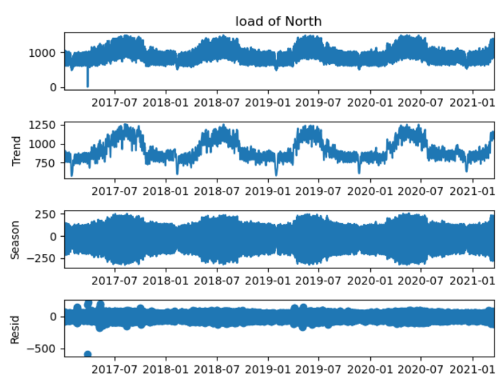

The time series decomposition section applies the STL (Seasonal-Trend decomposition using Loess) method to analyze the trending and seasonality components of the data.

## Holt-Winters Method

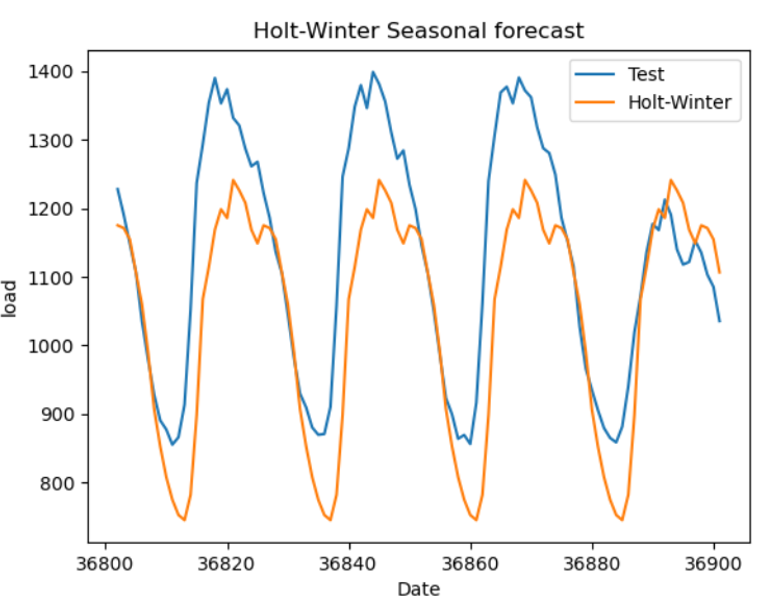

The Holt-Winters method is implemented to forecast electricity load using the train dataset and evaluate its performance against the test dataset.

## Feature Selection

The feature selection section discusses the process of selecting relevant features for the prediction model, including checking for collinearity and performing backward stepwise regression.

## Base Models

Several base models, including AFM, Naïve, Drift, and SES, are implemented to establish baseline predictions for electricity load.

## Multiple Linear Regression
A multiple linear regression model is developed using the OLS (Ordinary Least Squares) method and evaluated based on statistical criteria and prediction accuracy.

One-step prediction of model

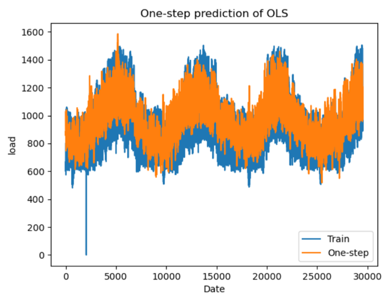

H-step prediction of model

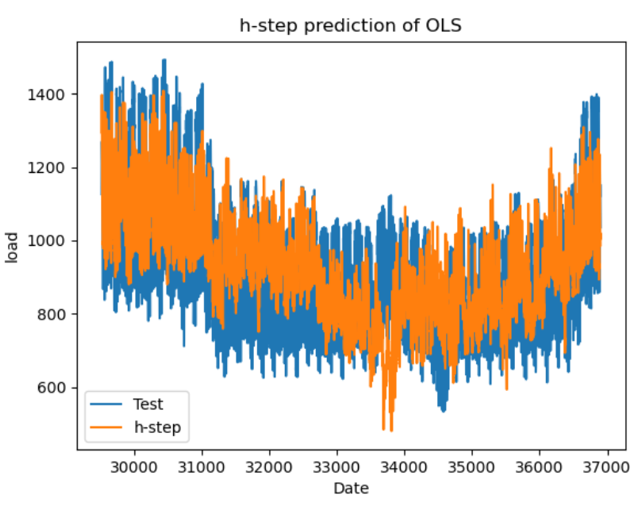

## ARMA, ARIMA, and SARIMA Model

ARMA, ARIMA, and SARIMA models are tested to analyze the stationarity of the data and select the best-fitting model for prediction.

GPAC table of original data

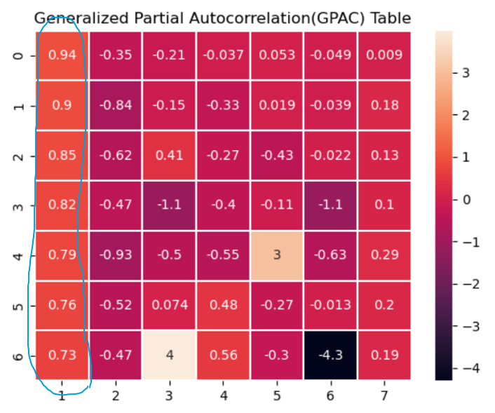

## Levenberg Marquardt Algorithm

The Levenberg Marquardt algorithm is applied to fit the data into the selected ARIMA model, and diagnostic tests are conducted to assess the model's performance.

## Diagnostic Analysis

The diagnostic analysis section includes various tests and assessments, such as confidence intervals, zero/pole cancellation, chi-square tests, and analysis of residual variance.

## Deep Learning Model

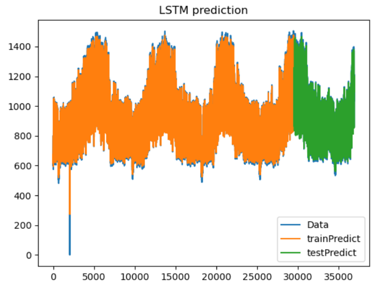

A LSTM (Long Short-Term Memory) deep learning model is implemented to forecast electricity load, and its performance is evaluated based on training and testing scores.

## Final Model Selection

The best-performing models, including LSTM and SARIMA, are compared based on their Mean Squared Error (MSE) values, and the LSTM model is selected as the final model.

## Forecast Function

The forecast function section presents the final forecast function derived from the selected ARIMA model.

## h-step Ahead Predictions

SARIMA model prediction

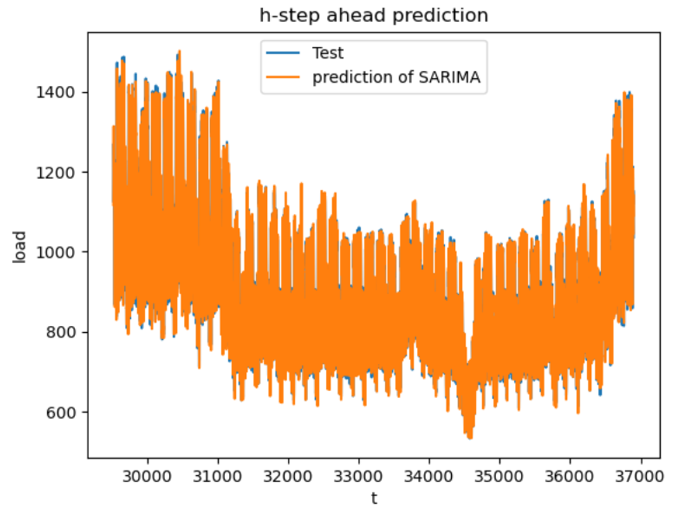

The h-step ahead predictions section showcases the predictions made by the selected model compared to the actual test data.

## Summary and Conclusion

The summary and conclusion section provides an overview of the project, its findings, and the significance of the analysis in understanding the relationship between electricity load and weather factors in Taiwan.

